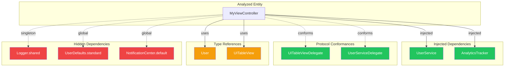

# Analyse Code Dependencies

Analyze the dependencies of a specific class, struct, protocol, or file and generate a Mermaid diagram showing all dependency types including hidden dependencies like singletons and static calls.

## Input
$ARGUMENTS - Entity name (class, struct, protocol, enum) or file path to analyze

## Dependency Categories

| Category | Description | Examples |
|----------|-------------|----------|
| **Injected** | Dependencies passed via constructor or property injection | `init(service: MyService)`, `var service: MyService` with `@Injected` |
| **Protocol Conformance** | Protocols the entity conforms to | `class Foo: MyProtocol` |
| **Inheritance** | Parent classes or base types | `class Child: Parent` |
| **Type References** | Types used in properties, parameters, return types | `var items: [Item]`, `func process() -> Result` |
| **Static Calls** | Direct calls to static methods or properties | `MyClass.shared`, `Utils.format()` |
| **Singletons** | Access to singleton instances | `.shared`, `.default`, `.instance`, `.current` |
| **Global State** | Access to global variables or app-wide state | `UserDefaults.standard`, `NotificationCenter.default` |
| **Factory Methods** | Object creation via factory patterns | `Factory.create()`, `Builder.build()` |
| **Service Locators** | Dependency resolution via container/locator | `Container.resolve()`, `ServiceLocator.get()` |
| **Closures/Callbacks** | Types captured or referenced in closures | Closure parameter types, captured variables |

## Supported Languages

| Language | Entity Types | Detection Patterns |
|----------|--------------|-------------------|
| **Swift** | class, struct, protocol, enum, actor | `class X`, `struct X`, `protocol X`, `enum X`, `actor X` |
| **Kotlin** | class, interface, object, data class | `class X`, `interface X`, `object X`, `data class X` |
| **TypeScript** | class, interface, type | `class X`, `interface X`, `type X` |
| **Java** | class, interface, enum | `class X`, `interface X`, `enum X` |

## Instructions

1. **Locate the entity**:
   - If a file path is provided, analyze that file
   - If an entity name is provided, search the codebase for the definition
   - Use glob/grep to find files containing `class EntityName`, `struct EntityName`, etc.

2. **Parse the entity definition**: Extract the full definition including:
   - Class/struct/protocol declaration
   - All properties and their types
   - All methods, their parameters, and return types
   - Protocol conformances and inheritance
   - Extensions of the entity (search for `extension EntityName`)

3. **Categorize dependencies**:

### Explicit Dependencies (Green - Good)
- **Constructor Injection**: Parameters in `init()` methods
- **Property Injection**: Properties marked with injection attributes (`@Inject`, `@Injected`, `@Autowired`, etc.)
- **Protocol Conformances**: Declared protocol requirements
- **Generic Constraints**: Type constraints in generic declarations

### Implicit Dependencies (Yellow - Caution)
- **Type References**: Types used in properties, method signatures
- **Inheritance**: Parent classes
- **Associated Types**: Types referenced but not injected
- **Closure Parameters**: Types in closure signatures

### Hidden Dependencies (Red - Problematic)
- **Singleton Access**: Look for patterns like:
  - `.shared`, `.default`, `.instance`, `.sharedInstance`, `.current`
  - `Singleton.getInstance()`, `X.standard`
- **Static Method Calls**: `ClassName.methodName()` where `methodName` is not a factory
- **Global State Access**:
  - `UserDefaults.standard`
  - `NotificationCenter.default`
  - `FileManager.default`
  - `Bundle.main`
  - `ProcessInfo.processInfo`
  - `DispatchQueue.main`
- **Service Locators**:
  - `Container.resolve()`, `Resolver.resolve()`
  - `ServiceLocator.get()`, `DI.get()`
- **Factory without Injection**: Direct factory calls not passed as dependencies
- **Environment/Context Access**: `@Environment`, `@EnvironmentObject` (SwiftUI)

4. **Analyze dependency direction**:
   - **Inbound**: What depends ON this entity?
   - **Outbound**: What does this entity DEPEND on?

5. **Calculate metrics**:
   - Total dependency count
   - Explicit vs Hidden ratio
   - Coupling score (higher hidden deps = higher coupling)
   - Testability score (more injection = better testability)

6. **Generate Mermaid diagram** with:
   - Central node for the analyzed entity
   - Color-coded nodes by dependency category
   - Solid lines for explicit dependencies
   - Dashed lines for implicit dependencies
   - Dotted red lines for hidden dependencies
   - Subgraphs grouping dependencies by category

7. **Generate recommendations**:
   - Identify hidden dependencies that could be injected
   - Suggest protocol abstractions for concrete dependencies
   - Flag testability concerns

8. **Save outputs**:
   - HTML file: `~/Desktop/code-dependencies-{entity-name}.html`
   - Markdown file: `~/Desktop/code-dependencies-{entity-name}.md`
   - Open HTML in browser

## HTML Template

```html
<!DOCTYPE html>
<html>
<head>
    <meta charset="UTF-8">
    <title>{entity-name} Code Dependencies</title>
    <script src="https://cdn.jsdelivr.net/npm/mermaid/dist/mermaid.min.js"></script>
    <style>
        body {
            font-family: -apple-system, BlinkMacSystemFont, sans-serif;
            margin: 20px;
            background: #f5f5f5;
        }
        h1 { color: #333; }
        h2 { color: #555; margin-top: 30px; }
        .mermaid {
            background: white;
            padding: 20px;
            border-radius: 8px;
            box-shadow: 0 2px 4px rgba(0,0,0,0.1);
        }
        .metrics {
            display: grid;
            grid-template-columns: repeat(auto-fit, minmax(200px, 1fr));
            gap: 15px;
            margin: 20px 0;
        }
        .metric {
            background: white;
            padding: 15px;
            border-radius: 8px;
            box-shadow: 0 2px 4px rgba(0,0,0,0.1);
        }
        .metric-value { font-size: 24px; font-weight: bold; }
        .metric-label { color: #666; font-size: 14px; }
        .good { color: #22c55e; }
        .warning { color: #f59e0b; }
        .bad { color: #ef4444; }
        .legend {
            display: flex;
            gap: 20px;
            margin: 20px 0;
            flex-wrap: wrap;
        }
        .legend-item {
            display: flex;
            align-items: center;
            gap: 8px;
        }
        .legend-color {
            width: 20px;
            height: 20px;
            border-radius: 4px;
        }
        .recommendations {
            background: white;
            padding: 20px;
            border-radius: 8px;
            margin-top: 20px;
        }
        .recommendations ul { margin: 0; padding-left: 20px; }
        .recommendations li { margin: 8px 0; }
        table {
            width: 100%;
            border-collapse: collapse;
            background: white;
            border-radius: 8px;
            overflow: hidden;
            margin: 20px 0;
        }
        th, td { padding: 12px; text-align: left; border-bottom: 1px solid #eee; }
        th { background: #f8f8f8; font-weight: 600; }
    </style>
</head>
<body>
    <h1>{entity-name} - Code Dependencies Analysis</h1>
    <p>Generated: {timestamp} | Language: {language} | File: {file-path}</p>

    <div class="legend">
        <div class="legend-item">
            <div class="legend-color" style="background: #22c55e;"></div>
            <span>Explicit/Injected (Good)</span>
        </div>
        <div class="legend-item">
            <div class="legend-color" style="background: #f59e0b;"></div>
            <span>Implicit (Caution)</span>
        </div>
        <div class="legend-item">
            <div class="legend-color" style="background: #ef4444;"></div>
            <span>Hidden (Problematic)</span>
        </div>
    </div>

    <div class="metrics">
        <div class="metric">
            <div class="metric-value">{total-deps}</div>
            <div class="metric-label">Total Dependencies</div>
        </div>
        <div class="metric">
            <div class="metric-value good">{explicit-deps}</div>
            <div class="metric-label">Explicit Dependencies</div>
        </div>
        <div class="metric">
            <div class="metric-value warning">{implicit-deps}</div>
            <div class="metric-label">Implicit Dependencies</div>
        </div>
        <div class="metric">
            <div class="metric-value bad">{hidden-deps}</div>
            <div class="metric-label">Hidden Dependencies</div>
        </div>
        <div class="metric">
            <div class="metric-value {testability-class}">{testability-score}%</div>
            <div class="metric-label">Testability Score</div>
        </div>
    </div>

    <h2>Dependency Graph</h2>
    <div class="mermaid">
    {mermaid-diagram-content}
    </div>

    <h2>Dependencies by Category</h2>
    <table>
        <thead>
            <tr>
                <th>Category</th>
                <th>Type</th>
                <th>Dependency</th>
                <th>Location</th>
            </tr>
        </thead>
        <tbody>
            {dependency-table-rows}
        </tbody>
    </table>

    <h2>Recommendations</h2>
    <div class="recommendations">
        {recommendations-content}
    </div>

    <script>mermaid.initialize({ startOnLoad: true, theme: 'default' });</script>
</body>
</html>
```

## Example Mermaid Output



## Detection Patterns by Language

### Swift
```swift
// Singleton patterns
\.shared
\.default
\.standard
\.instance
\.sharedInstance
\.current
\.main

// Static calls
ClassName\.staticMethod\(
ClassName\.staticProperty

// Global state
UserDefaults\.standard
NotificationCenter\.default
FileManager\.default
Bundle\.main
URLSession\.shared
DispatchQueue\.main

// Service locators
Container\.resolve
Resolver\.resolve
@Injected
@Inject

// Factory patterns
Factory\.create
Builder\.build
```

### Kotlin
```kotlin
// Singleton patterns
\.instance
\.INSTANCE
object\s+\w+
companion\s+object

// Static calls (companion object)
ClassName\.methodName\(

// Dependency injection
@Inject
@Autowired
Koin\.get
```

### TypeScript
```typescript
// Singleton patterns
\.getInstance\(\)
\.instance

// Static calls
ClassName\.staticMethod\(

// Service locators
container\.resolve
injector\.get
```

## Scoring

### Testability Score Calculation
```
testability = (explicit_deps / total_deps) * 100
```

- **90-100%**: Excellent - Highly testable, all dependencies injectable
- **70-89%**: Good - Mostly testable, few hidden dependencies
- **50-69%**: Fair - Some testability concerns, refactoring recommended
- **Below 50%**: Poor - Significant hidden dependencies, hard to test

### Recommendations Generation

For each hidden dependency found, generate a specific recommendation:

1. **Singleton to Injection**:
   > "Consider injecting `{Type}` instead of accessing `{Type}.shared`. This improves testability by allowing mock injection."

2. **Global State to Protocol**:
   > "Abstract `{GlobalType}` behind a protocol to enable testing with mock implementations."

3. **Static Calls to Instance Methods**:
   > "Replace static call to `{Type}.{method}()` with an injected instance to improve testability."

4. **Service Locator to Constructor Injection**:
   > "Replace service locator pattern with constructor injection for `{Type}` to make dependencies explicit."

## Notes

- If no entity is found, suggest similar names or list available entities in the file
- For protocols, analyze the default implementations and extensions
- For extensions, include them in the analysis of the main type
- Recursively analyze nested types (inner classes, nested structs)
- Consider async/await patterns and actor isolation in Swift
- Flag circular dependencies if detected
- For very large entities (>50 dependencies), group by module/namespace
