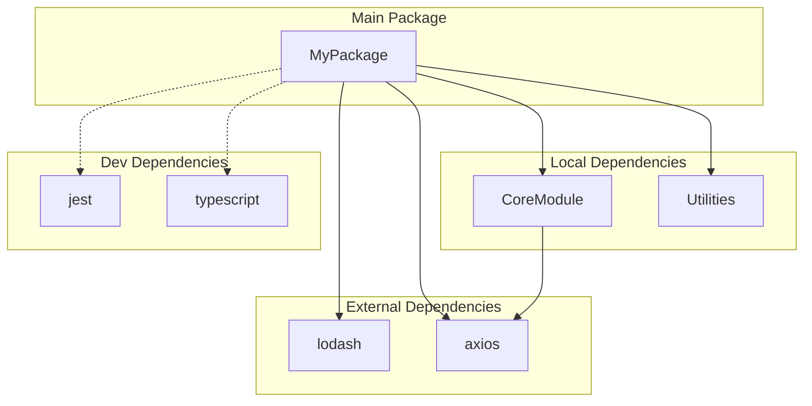

# Analyse Package Dependencies

Analyze the package or project at the given path and generate a Mermaid diagram showing the main package dependencies. Supports multiple languages and package managers.

## Input
$ARGUMENTS - Path to a package directory or project

## Supported Languages & Package Files

| Language | Package File(s) | Dependency Format |
|----------|----------------|-------------------|
| **Swift** | `Package.swift` | `.package(path:)`, `.package(url:)` |
| **Kotlin** | `build.gradle.kts`, `build.gradle`, `settings.gradle.kts` | `implementation()`, `api()`, `project()` |
| **TypeScript/JavaScript** | `package.json` | `dependencies`, `devDependencies`, `peerDependencies` |
| **Python** | `pyproject.toml`, `requirements.txt`, `setup.py`, `Pipfile` | Package names with versions |
| **Rust** | `Cargo.toml` | `[dependencies]`, `[dev-dependencies]` |
| **Go** | `go.mod` | `require` statements |
| **Ruby** | `Gemfile`, `*.gemspec` | `gem` declarations |
| **Java** | `pom.xml`, `build.gradle` | `<dependency>`, `implementation()` |
| **C#/.NET** | `*.csproj`, `*.sln`, `packages.config` | `<PackageReference>` |
| **PHP** | `composer.json` | `require`, `require-dev` |

## Instructions

1. **Detect language**: Examine the provided path to identify the language/package manager by looking for the package files listed above. If multiple are found, analyze each.

2. **Parse dependencies**: For each package file found, extract:
   - Package/module name
   - Local/workspace dependencies (monorepo internal packages)
   - External/remote dependencies
   - Development dependencies (optional, can be grouped separately)

### Language-Specific Parsing

**Swift (Package.swift)**:
- Package name from `name:` parameter
- Local: `.package(path:)`
- Remote: `.package(url:)`

**Kotlin/Gradle**:
- Module name from `settings.gradle.kts` or directory name
- Local: `project(":module")`
- Remote: `implementation("group:artifact:version")`

**TypeScript/JavaScript (package.json)**:
- Package name from `name` field
- Local: `file:`, `link:`, or workspace references (`workspace:`)
- Remote: All other dependencies in `dependencies`/`devDependencies`

**Python**:
- Package name from `pyproject.toml` `[project].name` or `setup.py`
- Local: `-e .` or path-based requirements
- Remote: Package names in requirements

**Rust (Cargo.toml)**:
- Package name from `[package].name`
- Local: `path = "..."`
- Remote: Dependencies with version only

**Go (go.mod)**:
- Module name from `module` declaration
- Local: `replace` directives with local paths
- Remote: `require` statements

3. **Build dependency graph**: Create a graph showing:
   - Main packages as nodes
   - Dependencies as directed edges (arrows pointing from dependent to dependency)
   - Group by: local packages vs external packages vs dev dependencies

4. **Generate Mermaid diagram**: Create a flowchart diagram with:
   - `graph TD` (top-down) or `graph LR` (left-right) based on complexity
   - Subgraphs for logical groupings (e.g., "External Dependencies", "Local Packages", "Dev Dependencies")
   - Clear node labels with package names
   - Use appropriate Mermaid styling for readability
   - Color coding by type if helpful (use `style` or `classDef`)

5. **Save the diagram as HTML**:
   - Save an HTML file to `~/Desktop/package-dependencies-{package-name}.html`
   - The HTML file should include:
     - Mermaid.js from CDN: `<script src="https://cdn.jsdelivr.net/npm/mermaid/dist/mermaid.min.js"></script>`
     - The Mermaid diagram inside a `<div class="mermaid">` tag
     - Basic styling for readability
     - A title and timestamp
   - Also save the raw Mermaid markdown to `~/Desktop/package-dependencies-{package-name}.md`

6. **Open the HTML file in the browser** using the `open` command

## HTML Template

Use this template structure for the HTML file:

```html
<!DOCTYPE html>
<html>
<head>
    <meta charset="UTF-8">
    <title>{package-name} Dependencies</title>
    <script src="https://cdn.jsdelivr.net/npm/mermaid/dist/mermaid.min.js"></script>
    <style>
        body { font-family: -apple-system, BlinkMacSystemFont, sans-serif; margin: 20px; background: #f5f5f5; }
        h1 { color: #333; }
        .mermaid { background: white; padding: 20px; border-radius: 8px; box-shadow: 0 2px 4px rgba(0,0,0,0.1); }
    </style>
</head>
<body>
    <h1>{package-name} - Package Dependencies</h1>
    <p>Generated: {timestamp} | Language: {language}</p>
    <div class="mermaid">
    {mermaid-diagram-content}
    </div>
    <script>mermaid.initialize({ startOnLoad: true, theme: 'default' });</script>
</body>
</html>
```

## Output Format

After analysis, provide:
1. Detected language/package manager
2. A summary of packages found and their dependency counts
3. The generated Mermaid diagram (displayed in a code block)
4. The file paths where the diagram was saved (HTML and MD)

## Example Mermaid Output



## Notes
- If no path is provided, analyze the current working directory
- For monorepos, identify the workspace root and show inter-package dependencies
- Skip test dependencies unless they have notable dependencies or specifically requested
- Limit diagram to direct dependencies (1 level deep) unless specifically asked for transitive dependencies
- Use dashed lines (`-.->`) for dev dependencies to distinguish them visually
- For very large dependency lists (>20 external packages), group them or show only the most significant ones
